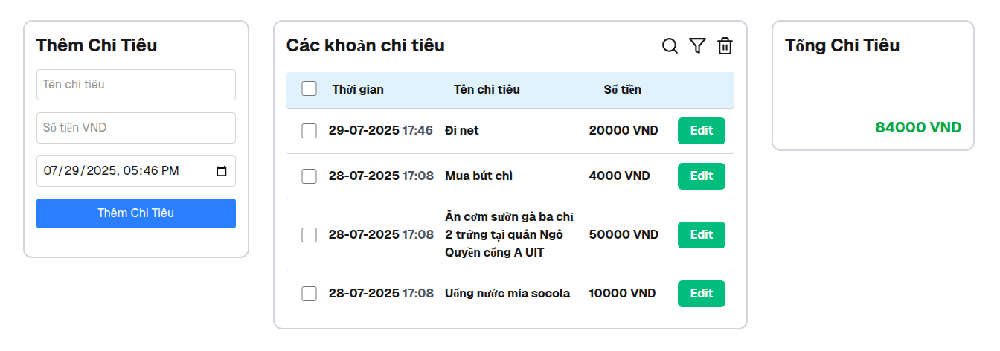

## Introduction

This repository contains my **final project** for the course **Basic Web Programming Training**, part of **UIT Mùa Hè Xanh 2025**.

The course was held during the summer and focused on building a solid foundation in web development, starting from version control and basic frontend technologies, then moving toward modern frameworks such as React and Next.js.  
This final project represents the result of applying what I learned throughout the course.

Below are my previous exercise submissions during the course:

- **HTML & CSS:** https://github.com/levanvux/html-css-mhx25  
- **JavaScript:** https://github.com/levanvux/bt-buoi3-mhx25  
- **JavaScript DOM:** https://github.com/levanvux/bt-buoi4-mhx25  
- **Basic ReactJS:** https://github.com/levanvux/bt-buoi5-mhx25  
- **NextJS & TailwindCSS:** https://github.com/levanvux/bt-buoi6-mhx25  

  

---

## About the Course

**MÙA HÈ XANH 2025 – Web Programming Training** is a free web development course organized by **WebDev Studios**.

### Course Content

- Git & Version Control
- HTML, CSS, JavaScript
- JavaScript DOM
- ReactJS (basic to advanced)
- Practical exercises after each topic
  
---

## Project demo

